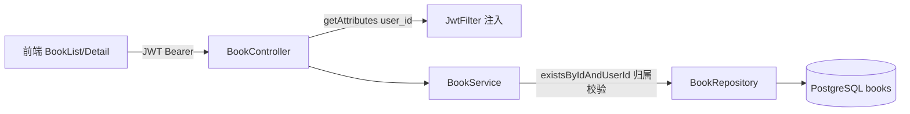

## 用户需求
继续推进 StoryCanvas 项目，进入 Phase 3「绘本项目管理」（对应文档 docs/16 §8.3 的 M2 里程碑）。在已完成的用户系统之上，新增绘本（Book）作为 AI 生成结果的容器，提供完整的增删改查与资源归属隔离。

## 产品概述
用户登录后可创建、查看、修改、删除自己的绘本项目；绘本以卡片网格形式展示，支持按状态（草稿/已发布/已归档）筛选与分页浏览；点击进入详情页可编辑信息或删除。所有操作仅限当前用户本人，跨用户访问一律拒绝。

## 核心功能
- 创建绘本（标题、描述、状态，封面上传为加分项暂留空）
- 获取「我的绘本」列表（分页 + 状态筛选）
- 获取绘本详情（校验归属）
- 更新绘本信息（标题/描述/状态，校验归属）
- 删除绘本（级联删除，校验归属）
- 跨用户越权访问拦截（只能操作自己的绘本）


## 技术栈选择
- 后端：C++17 + Drogon（沿用现有分层），PostgreSQL（books 表已存在，本阶段不改库）
- 前端：React 18 + TypeScript + Ant Design 5 + Tailwind CSS + Zustand（严格复用 Phase 2 已落地范式）
- 复用：ServiceResult、ApiResponse 统一响应、JwtFilter 注入 user_id、Drogon PATH_LIST 自动注册、CMake GLOB_RECURSE 自动编译、axios 拦截器、Zustand+persist

## 实现方案
### 后端（分层复用 Phase 2 范本）
1. **Model `Book`**：字段 id/user_id/title/description/cover_image/status/created_at/updated_at；`toJson()` 序列化（空 cover_image 统一为 null，规避问题 7/13 的 nullptr 陷阱）；`fromRow()` 反序列化。
2. **Repository `BookRepository`**：全参数化 SQL（`$1,$2`）。方法：create（RETURNING 回填 id/时间）、findById、findByUserIdPaginated(userId, status, limit, offset) 返回数组、countByUserId(userId, status)、update、deleteById、existsByIdAndUserId（归属校验，返回 bool）。
3. **Service `BookService`**：沿用 `ServiceResult{success,code,message,data}`。create 注入 user_id；list 计算分页并组装 `PageResult{items,total,page,limit}`；detail/update/delete 先 `existsByIdAndUserId` 校验归属，不存在或非本人返回 404/403；update 仅改 title/description/status。
4. **DTO `BookDto`**：`CreateBookRequest`/`UpdateBookRequest` 的 `fromJson/validate/getErrors`（标题 1-200、描述 ≤2000、status 枚举校验，返回 `std::vector<FieldError>`）；`BookResponse::toJson()`。
5. **Controller `BookController`**：`HttpSimpleController` + `PATH_LIST_BEGIN/PATH_ADD` 自动注册，5 条路由均挂 `"JwtFilter"`；`asyncHandleHttpRequest` 内 if/else 分发，外层 try/catch 保留 callback 副本兜底（沿用问题 11 写法）；路径参数 `req->getRoutingParameter("book_id")`，分页/状态 `req->getQuery("page"/"limit"/"status")`；身份取 `req->getAttributes()->get<std::string>("user_id")`。

### 前端（复用 Phase 2 范式）
- `types/book.ts`：Book、CreateBookRequest、UpdateBookRequest、BookStatus 枚举（复用 `PageResult<T>`）。
- `api/books.ts`：封装 5 个接口（沿用 `authApi` 写法）。
- `stores/bookStore.ts`：Zustand 管理列表/详情/loading（非持久化）。
- `components/book/BookCard.tsx` + `pages/books/BookList.tsx` + `pages/books/BookDetail.tsx`：Ant Design + Tailwind；列表含状态筛选 Tabs、分页、空态、新建按钮；详情含信息展示、编辑 Modal、删除确认。
- `App.tsx`：注册 `/books`(列表) 与 `/books/:id`(详情) 受保护路由（替换现有注释占位）；`Home.tsx` 增加「我的绘本」入口按钮。

## 实现注意事项
- **归属校验为硬要求**：所有单本操作必须先校验 `book.user_id == 当前 user_id`，非本人返回 403 而非 404（避免账号枚举，但本项目统一 404/403 均可，验收脚本覆盖两类）。
- **性能**：列表用 `LIMIT/OFFSET` 单查询 + `COUNT` 分离，配合 `idx_books_user_id`/`idx_books_status` 索引，无 N+1；`cover_image` 本期恒为 null，前端用占位图避免空图错误。
- **日志脱敏**：不打印 title 之外的敏感内容；异常按问题 11 统一 500 兜底并记录。
- **无需改库/CMake/main**：books 表已存在，GLOB_RECURSE 自动编译新 .cpp，控制器自动注册。

## 架构设计
沿用现有分层，数据流：JWT 鉴权 → BookController 取 user_id → BookService 业务(含归属校验) → BookRepository 参数化 SQL → PostgreSQL。



## 目录结构
```
backend/
├── models/Book.h            [NEW] Book 实体：字段、toJson()、fromRow()
├── models/Book.cpp          [NEW] 序列化/反序列化实现
├── repositories/BookRepository.h   [NEW] 数据访问接口声明
├── repositories/BookRepository.cpp [NEW] 参数化 SQL：create/findById/findByUserIdPaginated/count/update/delete/existsByIdAndUserId
├── services/BookService.h   [NEW] 5 个 CRUD 方法 + 归属校验
├── services/BookService.cpp [NEW] 业务逻辑，返回 ServiceResult
├── dto/BookDto.h            [NEW] CreateBookRequest/UpdateBookRequest/BookResponse 声明
├── dto/BookDto.cpp          [NEW] fromJson/validate/getErrors/toJson 实现
├── controllers/BookController.h    [NEW] HttpSimpleController + 5 路由(挂 JwtFilter)
└── controllers/BookController.cpp  [NEW] 分发 + 分页/归属校验 + try/catch 兜底

frontend/src/
├── types/book.ts            [NEW] Book/CreateBookRequest/UpdateBookRequest/BookStatus
├── api/books.ts             [NEW] booksApi 封装 5 接口
├── stores/bookStore.ts      [NEW] Zustand 列表/详情状态
├── components/book/BookCard.tsx  [NEW] 绘本卡片（封面占位/标题/状态标签/描述摘要）
├── pages/books/BookList.tsx      [NEW] 列表页：筛选 Tabs+分页+新建+网格
├── pages/books/BookDetail.tsx    [NEW] 详情页：信息+编辑 Modal+删除确认
├── App.tsx                  [MODIFY] 注册 /books 与 /books/:id 受保护路由
└── pages/home/Home.tsx      [MODIFY] 增加「我的绘本」入口

scripts/verify_m2.sh         [NEW] curl+jq 验收脚本（CRUD/分页/状态筛选/跨用户越权）
docs/开发记录.md             [MODIFY] 新增 Phase 3 章节并更新阶段进度表
```


## 设计风格
延续项目现有「清新柔和渐变 + Ant Design」基调，贴合儿童绘本主题。新建绘本列表页与详情页，整体采用圆角卡片、柔和紫蓝渐变背景、留白充足、轻量微交互（卡片 hover 上浮、按钮反馈）。

## 页面规划
### 绘本列表页 /books
- 顶部区块：页面标题「我的绘本」+ 右侧「新建绘本」主按钮；下方状态筛选 Tabs（全部/草稿/已发布/已归档）。
- 内容区块：响应式网格（`grid`）展示 BookCard；空态用 Ant Design `Empty` 引导新建；底部 `Pagination` 分页。
- 交互：点击卡片或「查看」进入详情；新建/编辑使用 `Modal` + `Form`。

### 绘本详情页 /books/:id
- 顶部区块：返回按钮 + 标题 + 「编辑」「删除」操作按钮（删除用 `Popconfirm` 二次确认）。
- 信息区块：`Descriptions` 展示标题、描述、状态（`Tag` 配色）、创建/更新时间（`formatDateTime` 本地化）。
- 占位区块：预留「AI 生成」入口（Phase 4/5 接入），本期显示引导提示卡片。
- 编辑区块：`Modal` 内 `Form` 编辑标题/描述/状态。

### 绘本卡片组件 BookCard
- 封面占位区（无图时用渐变占位 + 书本图标）；标题、状态 `Tag`、描述两行截断；底部「查看/编辑」入口。

## Agent Extensions
### Skill
- **cnb-code-commit**
  - 用途：Phase 3 全部代码完成后，按 docs/15 Git 工作流创建特性分支并提交、生成 PR（含规范的 feat 范围与描述）。
  - 预期结果：在 `feature/phase3-book-management` 分支提交后端/前端/脚本/文档改动，并创建 PR 供评审，符合项目提交规范。
